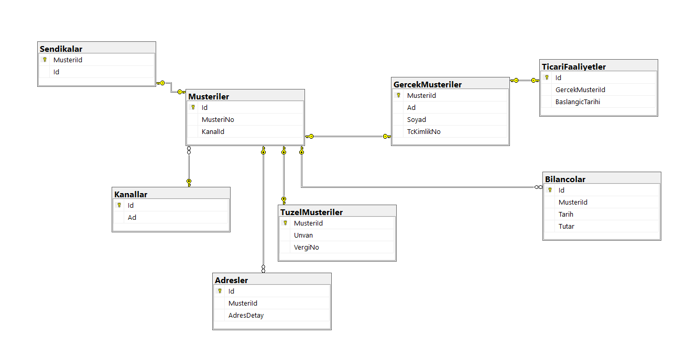

#Veri Tabana Tasarım Dersi

##Homework3-6

>Veri Tabanı Tasarım [Oynayma Listesi](https://www.youtube.com/playlist?list=PLqG356ExoxZXZQt9edXkCS-_dunCq-bXm)

>Gereksinim: ABC Bankası olarak müşterilerimizin takibini yapabilmeliyiz.

###Kabul Kriterleri:

    • 1)İki tip müşterimiz mevcut, Gerçek Müşteriler, Tüzel Müşteriler.
    • 2)Gerçek Müşteri, MüşteriNo, Ad, Soyad, TcKimlikNo alanlarına sahiptir.
    • 3)Tüzel Müşteri; MüşteriNo, Unvan, VergiNo, alanlarına sahiptir.
    • 4)Müşterilerin adreslerini takip edebilmeliyiz.
    • 5)Tüzel müşterilerin her 6 aylık dönemde bilanço bilgilerini kaydetmeliyiz. Örneğin 3 aylık bir tüzel müşterinin her 6 aylık dönemde gelen 6 adet bilanço kaydı olmalıdır. Bilanço bilgisi olarak bilanço tutarı ve bilanço tarihi bilgisini tutmak yeterlidir.
    • 6)Gerçek müşterilerin bazıları Ticari Faaliyet gerçekleştirmektedir. Bu tip müşterilerimiz için de bilanço takibi yapabilmeliyiz.
    • 7)Bir kişinin veya kurumun bankamızın müşterisi olabilmesi için çeşitli kanallar mevcuttur.
      (İnternet, Şube vb.) Müşterinin hangi kanaldan bankamıza ilk kez katıldığı bilgisini de tutmak istiyoruz.

#Tasarım

